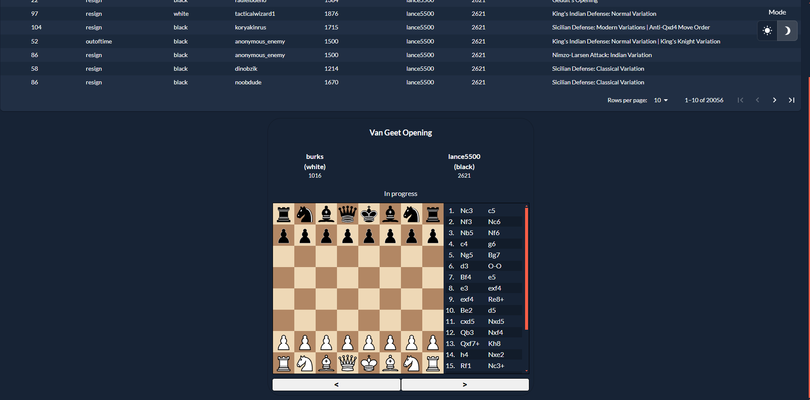
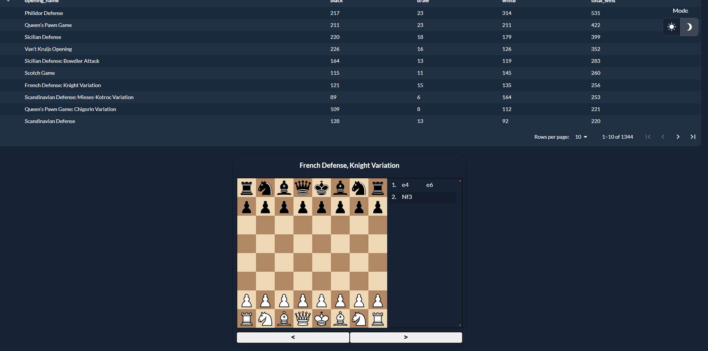
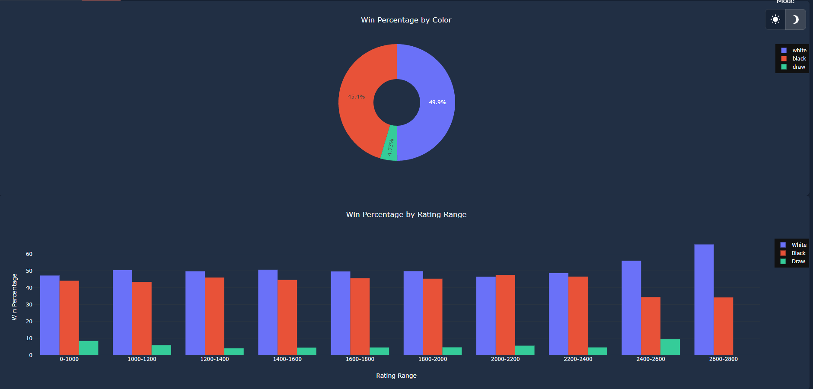

# Taipy Chess

## Table of Contents

- [Features](#features)
- [Description](#description)
- [Installation](#installation)
- [Background](#background)

## Description

## Features

- See a variety of chess games!
- See the most popular openings!
- See the most successful openings!
- Get to learn more about different players!

## Screenshots

|               |    |         |
| --------------------------------------- | ---------------------------------- | --------------------------------- |
| **Check out a variety of chess games!** | **See the most popular openings!** | **Get to learn more about chess** |

## Installation

- Clone the repository:

  ```bash
      git clone https://github.com/KorieDrakeChaney/taipy-chess.git && cd taipy-chess
  ```

- Install the requirements:

  ```bash
  pip install -r src/requirements.txt
  ```

- Set up the Chess Library:

  - Set your directory to 'src/chess_library/front-end/':

    ```bash
    cd src/chess_library/front-end/
    ```

  - Install the requirements:

    ```bash
    npm install
    ```

  - Now build:
    ```bash
    npm run build
    ```

- Run the app:

  - Go back to root directory:

    ```bash
    cd ../../../
    ```

  - Run the app:
    ```bash
    python src/main.py
    ```

## Background

I never done a Creator Quest before. I never even heard of it, until 2 days ago after reading this blog [post](https://medium.com/@bap_16778/5-achievable-side-hustles-for-developers-946c7cad1ff2). I checked it out, and saw a live creator quest, to my surprise, it only had a couple days before it ended. I wanted to challenge myself to see if I can learn a new [technology](https://taipy.io) and build something with it in a couple days. I was able to do it, and I'm proud of myself. I hope you enjoy my project. :smile:
